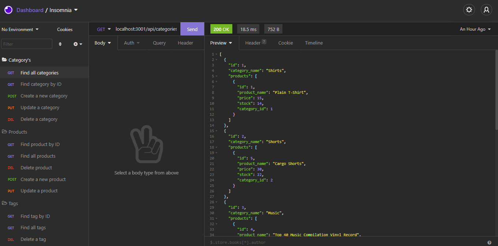
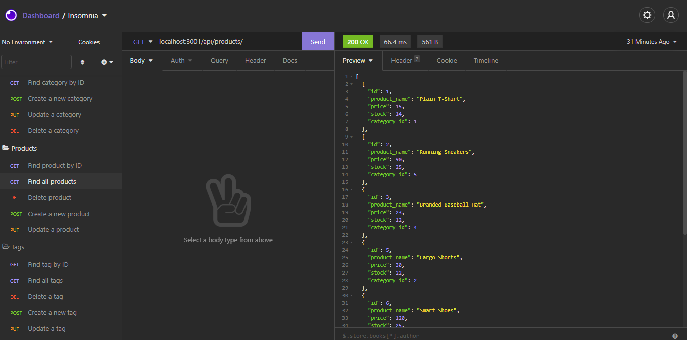
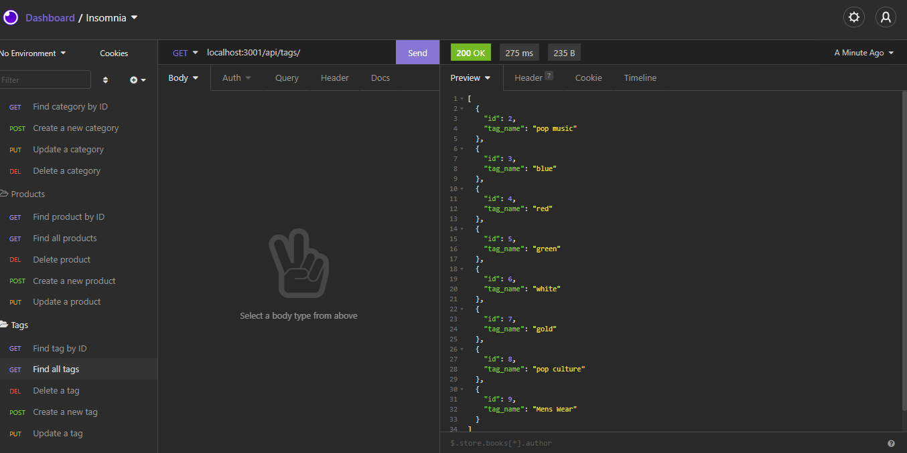

# E-Commerce-Back-End
A back-end framework for an e-commerce website, which uses NodeJS, Express.js and Mysql to provide the back-end functionality.


[](https://opensource.org/licenses/MIT)

### Table of Contents

- [Description](#description)
- [Installation](#installation)
- [Usage](#usage)
- [Application Image](#application-image)
- [Walk-through Video](#walk-through-video)
- [Contributing](#contributing)
- [Testing](#testing)
- [Questions](#questions)


## Description

The complete back-end functionality for an e-commerce web-site. The Application uses Express.js API and Sequelize as an ORM to interact with a MySQL database.  This application includes the creation of a database using MySql along with models and associations. In the walk-through video you can see how the API endpoints are requested through the use of RESTful CRUD operations. 


## Installation

1. Clone the above repo to your machine

2. run `npm i` to install your dependencies 

3. create a .env file with the following fields ` DB_USER=root, DB_NAME=ecommerce_db, and DB_PW="Your MYSQL password here"`

4. Make sure your .env file is added to your `gitignore`


## Usage

To use the app you will have to run the following commands sequentially on your terminal

```bash
* mysql -u root -p
* source db/schema.sql;
* quit

* npm run seed

* npm run dev
or
* npm run start
```


## Application Image 

 

  

  


 ## Walk-through Video

##### Video: [e-commerce back-end walk-through](https://www.youtube.com/watch?v=iEXJofg6HSs)


## Credits

If you want to contribute please create and issue or pull-request and I will get back to you as soon as possible.

## Questions

If you have any questions feel free to contact me here:

 ##### Github: [github.com/mus-ali1](https://github.com/mus-ali1)
 

 ##### Email: [mustafa_a_ali@outlook.com](mailto:mustafa_a_ali@outlook.com?subject=[GitHub])

## Testing

No testing available at this moment.
